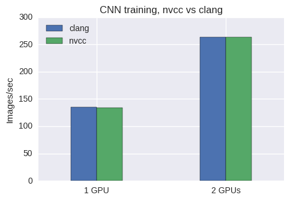

# TensorFlow benchmarks with CUDA clang and nvcc

This repo contains a set of scripts to compare nvidia's CUDA compiler (`nvcc`) and
clang (that has built-in CUDA support). We build CUDA-enabled TensorFlow
with both compilers and run some benchmarks from [this repo](https://github.com/tensorflow/benchmarks).

Both the build and the benchmarks run inside Docker, so they should be
portable to most Linux systems. We let TensorFlow download a recent version of
Clang during the build (rev 321529 as of this writing). The nvcc build uses
the system gcc in Ubuntu 16.04 (5.4.0).

**SPOILER ALERT**: clang and nvcc perform about the same for training CNNs:



## Getting started

Update the `docker-compose.yml` file with the Nvidia driver version installed on your
system, then:

```
docker-compose build
docker-compose run builder bash
```

In the docker shell:

```
# Build wheels for both clang and nvcc
./build.sh
```

## Example output

```
TensorFlow:  1.6
Model:       resnet50
Dataset:     imagenet (synthetic)
Mode:        training
SingleSess:  False
Batch size:  32 global
             32 per device
Num batches: 100
Num epochs:  0.00
Devices:     ['/gpu:0']
Data format: NCHW
Layout optimizer: False
Optimizer:   sgd
Variables:   parameter_server
==========
Generating model
Running warm up
Done warm up
Step    Img/sec total_loss
1   images/sec: 135.5 +/- 0.0 (jitter = 0.0)    8.235
10  images/sec: 133.7 +/- 0.9 (jitter = 1.0)    8.152
20  images/sec: 134.4 +/- 0.5 (jitter = 0.5)    8.250
30  images/sec: 134.5 +/- 0.3 (jitter = 0.5)    7.919
40  images/sec: 134.7 +/- 0.2 (jitter = 0.5)    8.125
50  images/sec: 134.7 +/- 0.2 (jitter = 0.4)    8.180
60  images/sec: 134.7 +/- 0.2 (jitter = 0.5)    8.248
70  images/sec: 134.7 +/- 0.1 (jitter = 0.5)    7.892
80  images/sec: 134.6 +/- 0.1 (jitter = 0.5)    7.879
90  images/sec: 134.6 +/- 0.1 (jitter = 0.6)    8.065
100 images/sec: 134.5 +/- 0.1 (jitter = 0.6)    8.023
----------------------------------------------------------------
total images/sec: 135.72
----------------------------------------------------------------
```

## Build times

clang

```INFO: Elapsed time: 427.788s, Critical Path: 70.81s```

nvcc

```INFO: Elapsed time: 473.923s, Critical Path: 176.95s```
